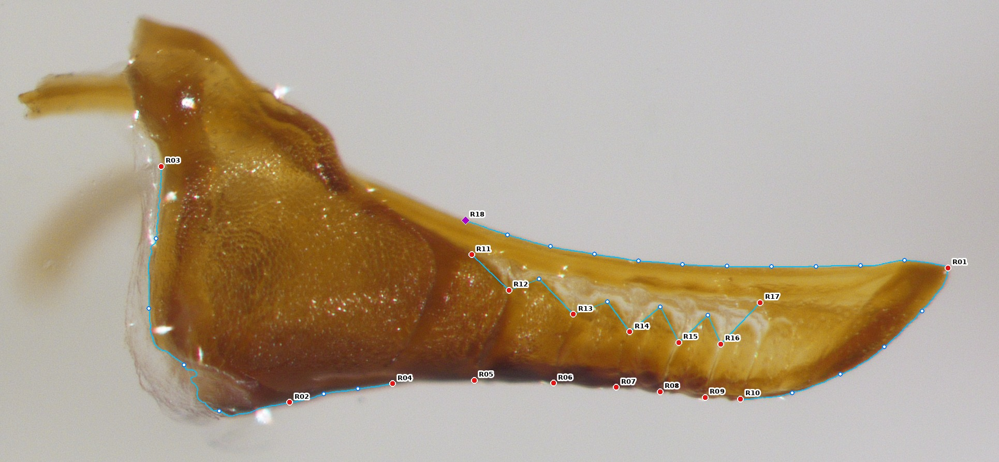
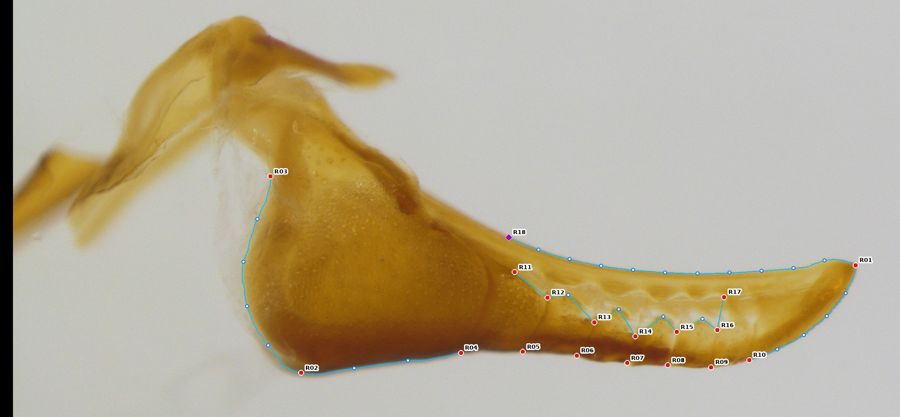
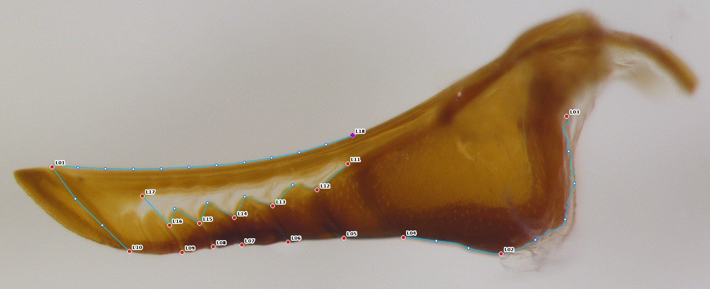
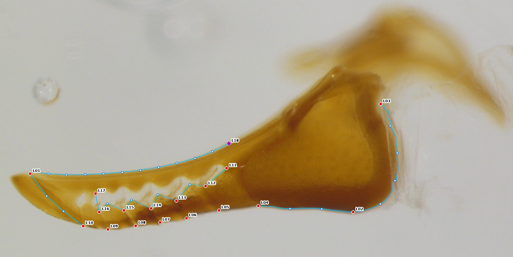
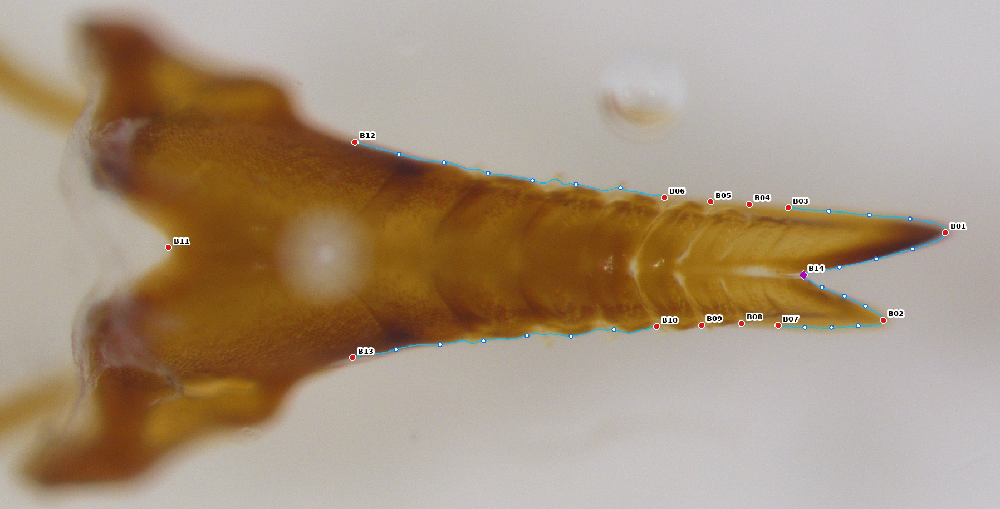
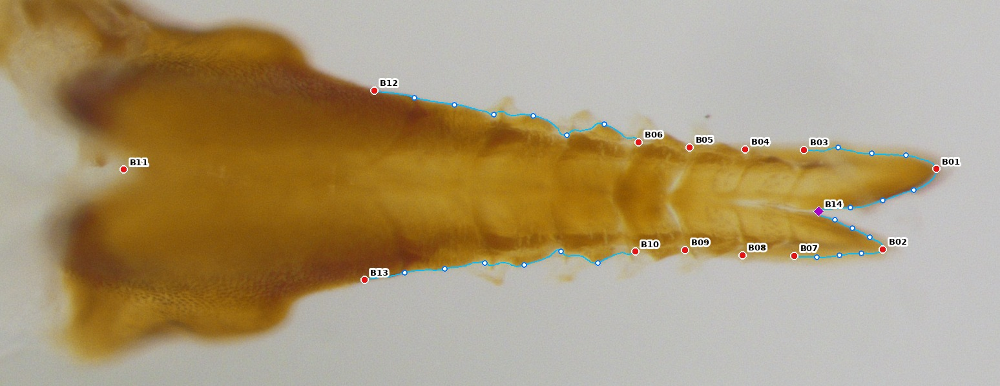
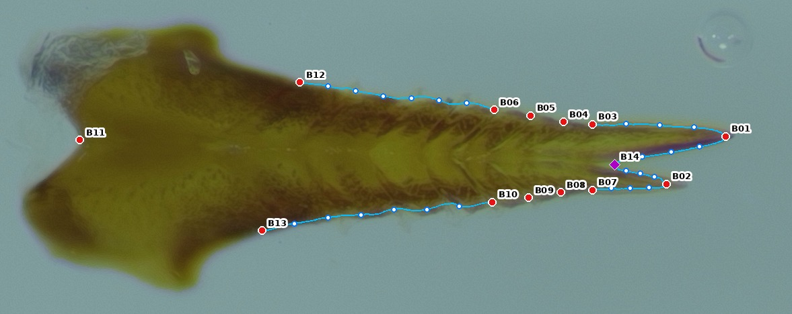

# A landmark + semilandmark protocol for the *Neodiprion* lance (second valvula), built for deep-learning digitization

*Protocol v1.4, 2026-09-24. v1.4: the lateral dorsal curve starts on the line through the window's proximal end (R11/L11) instead of suture 1, away from the golden basal flap (evidence: analysis/Protocol_Comparison_Findings.docx, Section 4.2). v1.3: the dorsal heel junction (old R29/L25) is dropped as inconsistent and noisy; points are renumbered so every view is clicked in one unbroken sequence, with the computed point last (R18, L18, B14). v1.1: the Bottom view covers the whole structure, not only the distal third. v1.2: no Bottom points on the proximal margin, which can be obscured and cannot be cleared on these mounted samples; the basal lobes are anchored at their shoulders instead. Replaces the Lance Morphometrics section of `Lance_Imaging_Morphometrics_v2.docx`; imaging and rehydration steps are unchanged except where noted in §7.*

Files in this folder:

| File | What it is |
|---|---|
| `Lance_Landmarking_Protocol.md` | this document |
| `landmark_schema.json` | machine-readable point and curve definitions, including the old-point → new-point mapping |
| `figures/protocol_{Right,Left,Bottom}_<specimen>.jpg` | the protocol drawn on real specimens: *N. lecontei* parent `LL280xLL284-1`, *N. pinetum* parent `PX014xNP060v4-2`, LBX `FEB1xPBX012-1-V35` |
| `figures/bottom_basal_survey_12specimens.jpg` | whole Bottom view of 12 specimens across all five groups, used to design the basal part of the Bottom protocol (§3.3) |
| `figures/bottom_shoulder_candidates.jpg` | four candidate definitions for B12/B13 drawn on the same specimens (§3.3) |
| `tools/audit/bottom_shoulder_stability.py` | the 40-specimen stability test that chose the B12/B13 definition |
| `tools/mask_edits.json` | hand cuts to the automatic outline for the figures (attached rods/flaps), and occlusion flags |
| `Lance_Imaging_Morphometrics_v3.docx` | the step-by-step protocol for a human digitizer (Fiji/ImageJ), laid out like the v2 lab protocol; generated by `tools/docgen/make_protocol_docx.py` |
| `annotation_sheet_template.csv` | one row per digitized image: calibration, flagged points, visible suture count |
| `tools/roi_to_landmarks.py` | converts a digitizer's ImageJ ROI set (anchors + traced curves) into the full configuration, with QC messages; `tools/test_roi_roundtrip.py` checks it against the figure geometry |
| `tools/scheme.py` | single source of truth for the scheme (the figures and schema are generated from it) |
| `tools/draw_protocol.py`, `tools/export_schema.py` | figure and schema generators |
| `tools/audit/` | the scripts behind every number in §1 |

---

## Summary

The old protocol clicks 85 points per specimen (Right 36, Left 32, Bottom 17). All of them are treated as fixed landmarks, even though 22 are construction points ("equidistant", "directly above point N"). Another 66 are defined by the image frame ("topmost", "bottommost", "lowest"). Its least reliable points are the heel points and the Bottom split point. Those same points dominate the first principal component of shape in every view, so the biggest axis of "shape variation" in the current dataset rests on the noisiest measurements.

The new protocol:

1. **Separates what the eye can actually locate from what it can't.** 47 **anchors** are discrete, frame-independent anatomical points that a person or a CNN places directly. 70 **sliding semilandmarks** sit on curves; software spaces them evenly along a traced outline, and they slide during Procrustes superimposition. 3 **computed points** are derived geometrically and never hand-placed. That gives 120 points per specimen from 47 clicks plus traced outlines.
2. **Retypes the specific points the data show are failing.** The Bottom split point (old 9) has 99% of its error along the midline. It becomes a computed point (B14). The heel extremes (old 1–3) have 72–87% of their error along the outline. They become anchors at tissue junctions plus a heel curve.
3. **Covers the whole structure.** The Bottom view now runs from the median basal notch and the shoulders of the two basal lobes to both tips; the old one stopped at the fourth-last suture. It never uses the proximal margin, which membrane or the basal flap can cover. Laterally, the heel margin and proximal ventral margin are added.
4. **Treats segments (sutures) as a serial, variable-count structure.** The fixed-count "first seven sutures" labels are kept as anchors, but a separate detector records every suture. Suture count and spacing become phenotypes in their own right, which matters in a segregating population.
5. **Is built for a CNN.** Anchors map to heatmap channels. Curves come from a segmentation head. Computed points are post-processing. **44 of the 47 anchors have an old-protocol equivalent,** so the ~920 existing digitized images become training labels without re-clicking. Only outline masks and the 3 new basal Bottom anchors need to be added.

---

## 1. What is wrong with the old protocol: evidence from the existing data

All numbers below come from the 979 digitized configurations in `landmarked_images/` (Right 342, Left 322, Bottom 315 with the correct point count) and from the per-landmark test error of the current DSNT CNN (`lance_landmarking/cnn/runs/21ix26_runs`). Scripts are in `tools/audit/`.

### 1.1 A few points carry most of the error, and they drive PC1

| View | Worst points (CNN test error, px; Procrustes SD ×10³) | Typical point | PC1 % of shape variance | Points loading most on PC1 |
|---|---|---|---|---|
| Right | 2 heel protrusion (26.2; 15.7), 3 heel lowest (21.8; 18.8), 1 heel recess (18.7; 11.4) | ~11 px; ~5 | 40.0 | 3, 2, 13, 28 |
| Left | 2 (22.7; 16.5), 1 (17.4; 13.1), 3 (17.1; 19.6) | ~10 px; ~6 | 36.7 | 3, 2, 13, 26 |
| Bottom | **9 split point (43.4; 88.3)**, about 2× every other point | ~14 px; ~30 | 43.4 | **9**, 7, 2, 12 |

The CNN isn't failing at random. It fails where people disagree with each other, because the point is not well defined.

### 1.2 That error runs along the outline, which is what sliding semilandmarks fix

I split each point's residual (after superimposition) into the part along the local outline and the part across it:

| Point | Share of variance along outline/axis | SD along vs across (×10³) |
|---|---|---|
| Bottom 9, split point (along midline) | **0.99** | 88.0 vs 7.4 |
| Right 3, "lowest point of heel" | 0.84 | 17.3 vs 7.4 |
| Right 2, "furthest protruding point of heel" | 0.84 | 14.4 vs 6.2 |
| Left 3 | 0.87 | 18.2 vs 7.1 |
| Left 2 | 0.72 | 14.1 vs 8.7 |
| For comparison: Right 6, a suture end | 0.74 | 5.5 vs 3.2 (small in both directions) |

People agree on where the margin is; they disagree on where along it the extremum falls. That is the standard signature of an extremal point on a gently curved margin. Sliding semilandmarks were designed for exactly this case (Bookstein 1997; Gunz & Mitteroecker 2013). For the Bottom split point, digitizers agree on the midline almost perfectly (SD 0.007) but not on where along it the point goes (SD 0.088, 12× larger). There is no single, visible "most proximal point of the split" to find.

### 1.3 Definitions depend on how the specimen is mounted

In the old text, 27/36 Right, 25/32 Left and 14/17 Bottom definitions use the image frame: "topmost", "bottommost", "lowest", "directly above/below". When a lance is mounted a few degrees rotated, "bottommost point of suture 4" moves along the suture. Superimposition removes rotation of the *finished* configuration, but it cannot undo a point that was placed somewhere else because of the rotation. This also makes the CNN's rotation augmentation inconsistent with its labels: rotate the image and the label moves rigidly, but the definition would put the point elsewhere.

### 1.4 22 of 85 points are constructions but are analysed as landmarks

Right 11, 12, 24, 26, 27, 30–36; Left 11, 12, 26–32; Bottom 12 are defined by spacing or vertical projection from other points. Analysed as fixed landmarks, their position along the margin is arbitrary yet counts as shape. Treated properly, they are semilandmarks.

### 1.5 Coverage gaps

- **Bottom view covers only the distal third of the lance.** Its centroid size therefore varies more (CV 8.6% vs 4.1% laterally) and is not a whole-lance size measure. Seven of its 17 points (6–12) sit within a few pixels of each other at the fork. At the CNN's input resolution the lance is ~52 px wide, and those points get confused with each other.
- **Unsampled margins:** ventral margin between the heel and suture 1; the heel's proximal margin (only old 2, a single extremal point); the medial margins of the two tips in the Bottom view.

### 1.6 Other issues found

- **The Bottom text has the sides swapped.** It says points 2–5 are on the *short* side and 14–17 on the *long* side. In all 315 digitized Bottom files, 2–5 are on the long-tip side and 14–17 on the short-tip side; digitizers followed the reference figure, not the text. The new protocol names sides explicitly.
- **Suture count is fixed by the protocol.** It says "first seven" on Right and "first six" on Left. In F1, LBX and PBX individuals segment number is a plausible segregating trait. If an individual has one fewer clearly visible suture, it gets forced labels, and a miscount shifts every later suture's identity.

### 1.7 What re-analysing the old data can and cannot tell us

I re-ran the Procrustes fit on the old Right and Left data, treating the construction and extremal points as sliders (geomorph `gpagen`, bending energy). Cross-type separation (Procrustes ANOVA R² for Group) barely moved: Right 0.157 → 0.144, Left 0.198 → 0.220. **Retyping old points after the fact doesn't recover much.** Only one heel point exists to slide, and the placement error is already baked into the coordinates. The gains need re-annotation of the heel curve and the new definitions, and they have to be confirmed by the repeatability study in §8.

For Bottom, dropping the fork cluster (6–12) leaves Group R² unchanged (0.246 → 0.248). So those 7 points add no discriminating information beyond tips and margin sutures. But dropping **only** point 9 lowers it to 0.181. **Fork depth carries real biological signal; it is just measured badly.** The new protocol therefore keeps fork depth and measures it reproducibly (B14), rather than dropping it.

(Caveat: Group R² here includes a camera-session effect, since Parents were imaged on a different setup at 1260 vs 927 px/mm. It is a relative comparison between schemes, not an estimate of biological divergence.)

---

## 2. Design principles

1. **Three point roles, each analysed correctly.** Anchors are fixed landmarks (Bookstein Type I = tissue junction, Type II = curvature extremum). Semilandmarks slide on curves (Gunz et al. 2005). Computed points (Type III) are never clicked. Each role has its own statistical treatment and its own CNN output.
2. **Definitions are relative to tissue, not the image.** No "topmost/bottommost". Extrema are taken in the lance's own frame (e.g., "deepest point of the concavity between X and Y").
3. **Nothing is placed by eye-balled spacing.** Humans and the CNN locate anchors and outlines; software spaces the semilandmarks.
4. **Fixed cardinality where homology is certain; variable cardinality where it isn't.** Sutures 1–7/1–6 are anchors, the rest are counted.
5. **Continuity.** Every anchor corresponds to an old-protocol point, so old data migrate and old/new results can be compared on the same specimens.
6. **Resolution-aware.** No two anchors are closer than about one CNN heatmap cell at the planned crop resolution. The crowded Bottom fork cluster is replaced by curves.

---

## 3. The protocol

Legend for the figures: **red dot** = anchor (labelled), **purple diamond** = computed point, **white circle** = sliding semilandmark, **blue line** = traced curve.

Orientation and side naming follow the old imaging protocol: **Right** = right-facing image of the longer half, **Left** = left-facing image of the shorter half, **Bottom** = downward-facing image showing both tips. "Proximal" = toward the heel/base, "distal" = toward the apex, "ventral" = the darkened, sclerotized edge (downward in lateral images).

### 3.1 Right view (long half): 17 anchors + 1 computed + 24 semilandmarks = 42 points

| ID | Type | Definition | Old # |
|---|---|---|---|
| R01 | II | **Apex**: distal tip of the lance (maximum curvature of the tip outline) | 13 |
| R02 | I | **Heel–ventral junction**: proximal end of the dark, sclerotized ventral margin, where it meets the heel. Replaces "lowest point on the bottom of the heel". | 3 (redefined) |
| R03 | II | **Proximal heel notch**: deepest point of the concavity on the proximal margin, between the heel and the basal process above it. Replaces "most recessed point above the heel". | 1 (redefined) |
| R04–R10 | I | **Ventral ends of sutures 1–7**: where each suture meets the ventral margin, counting from the heel | 4–10 |
| R11 | I | **Window, proximal end**: most proximal point of the dorsal margin of the cuticular window | 14 |
| R12–R16 | I | **Dorsal ends of sutures 2–6**: where each suture meets the dorsal margin of the cuticular window | 15, 17, 19, 21, 23 |
| R17 | I | **Window, distal end**: most distal point of the dorsal margin of the cuticular window | 25 |
| R18 | III (computed) | **Dorsal curve start** (v1.4): moving dorsally from R11 (the window's proximal end) along the line perpendicular to the lance's own axis R02 → R01, the first point where the line reaches the lance's dorsal edge (never the golden basal flap above it) | ≈ 31 |

| Curve | From → to | Semilandmarks | Replaces old |
|---|---|---|---|
| R.heel | R03 → R02 along the proximal heel margin | 4 | 2 |
| R.vbase | R02 → R04 along the ventral margin | 2 | (unsampled) |
| R.vdist | R10 → R01 along the ventral margin | 4 | 11, 12 |
| R.dorsal | R18 → R01 along the dorsal outline | 10 | 26–28, 30–36 |
| R.window | R11 → R12 → … → R16 → R17 along the window's dorsal margin; one semilandmark between each pair of suture ends (the scallop crests) | 4 | 16, 18, 20, 22 |

**Changed in v1.4: where the dorsal curve starts.** In v1.3 the curve started on the line through R04 (suture 1), next to the heel. There the golden basal flap often lies over the dorsal margin, and because the curve's ten semilandmarks are spaced from its start, a start point placed on the flap drags the whole curve off the edge. Moving the start to the line through R11 drops the 17–20% of the curve next to the heel. In a retraining comparison on identical images it gave the best repeatability of the new versions (Right shape repeatability 0.64 vs 0.56 for the suture-1 start and 0.59 for the old protocol) and no dorsal-curve failures on never-seen Left specimens with flaps (0 of 46, against 4 of 46 before the label fix).

**Dropped in v1.3:** old 29, the "intersection of the tongue and groove and the dorsodistal part of the heel" (v1's R02). It is an internal texture junction, not an outline feature. Its visibility varies between specimens, and it sits right at the edge in some and well inside in others. It would be inconsistent and noisy, so the dorsal curve now starts at the computed point R18 instead.

Retired: old 24 ("topmost point of the sclerotized edge directly above point 10") is a vertical projection with no anatomical definition.

### 3.2 Left view (short half): 17 anchors + 1 computed + 22 semilandmarks = 40 points

Same definitions as Right, with these differences:

| ID | Type | Definition | Old # |
|---|---|---|---|
| L01 | II | **Short-half apex**. In this view the long half's tip sticks out beyond it, so L01 is an **interior** point, not the tip of the silhouette | 13 |
| L02, L03 | I, II | Heel–ventral junction; proximal heel notch (as R02, R03) | 3, 1 |
| L04–L09 | I | Ventral ends of sutures 1–6 | 4–9 |
| L10 | II | **Ventral split point**: the last point on the ventral margin before the two halves' edges diverge | 10 |
| L11 | I | Window, proximal end | 14 |
| L12–L16 | I | Dorsal ends of sutures 2–6 | 15, 17, 19, 21, 23 |
| L17 | I | Window, distal end | 24 |
| L18 | III | Dorsal curve start (as R18, through L11) | ≈ 27 |

Curves: L.heel (4), L.vbase (2), L.dorsal L18 → L01 (10), L.window (4), and **L.vdist L10 → L01 (2)**. The last one runs along the short half's own distal ventral edge, which is an interior edge because the long half's tip forms the silhouette here (old 11, 12). Old 25 (tongue-and-groove × heel) is dropped, as on Right.

### 3.3 Bottom view (whole structure, both halves): 13 anchors + 1 computed + 24 semilandmarks = 38 points

The old Bottom protocol stopped at the fourth-last suture and sampled only the distal third. The new one spans the structure from the median basal notch to both tips. I designed the basal part after looking at the whole Bottom view in 12 specimens across all five groups (`figures/bottom_basal_survey_12specimens.jpg`). In every one, the proximal part has the same organisation:

- a **median basal notch**: a V-shaped emargination between the two halves at the proximal end;
- a **basal lobe** on each side, flaring out laterally, ending in a posterolateral corner;
- a **shoulder** on each side, where the outer margin of the shaft starts to curve outward into the lobe.

**The proximal margin is not used.** The lobes' proximal margins and posterolateral corners are often covered by pale membrane, attached golden rods, or the golden basal flap. By eye, the long-half corner was obscured in about 7 of the 12 survey specimens. The mounting of these samples can't be changed, so no Bottom point sits on that margin. The basal region is represented by the median notch (B11), which was clearly visible in all 12, and by the two shoulders (B12, B13), which sit well distal to the covered region.

**Anchors**

| ID | Type | Definition | Old # |
|---|---|---|---|
| B01 | II | Long-half apex | 1 |
| B02 | II | Short-half apex | 13 |
| B03–B06 | I | Long half: outer ends of the 1st–4th sutures counted **from the apex** | 2–5 (the old text wrongly says "short side") |
| B07–B10 | I | Short half: outer ends of the 1st–4th sutures counted from the apex | 14–17 (the old text wrongly says "long side") |
| B11 | II | **Median basal notch**: deepest (most distal) point of the V-shaped emargination in the proximal margin, between the two basal lobes | new |
| B12 | II | **Long-half shoulder**: where the outer margin of the shaft begins to curve outward into the basal lobe. Lay a straight edge against the outer margin so that it touches the shaft margin and the front of the lobe; B12 is the margin point farthest from that edge. (Formally: moving proximally from B06, the first concavity of the outer margin deeper than 0.15 × the shaft width at the fourth-last sutures, measured from the margin's convex envelope; B12 is its deepest point. A true shoulder lies well distal to B11, a median 30% of the way to the apices; a result within 5% of B11's level means a foreign structure has been traced, and the point is placed by hand.) | new |
| B13 | II | **Short-half shoulder**: the same, on the short half, starting from B10 | new |

**Computed point**

| ID | Definition |
|---|---|
| B14 | **Fork crotch**: on the silhouette margin between the two apices, the point closest to the base along the lance's own long axis. The axis runs from **B11** to the midpoint of the apices. B14 is the proximal end of the *visible background gap* between the halves. The pale internal slit that sometimes continues further proximally is excluded, because whether it shows depends on focus and compression. Replaces old 9. |

**Curves**

| Curve | From → to | Semilandmarks |
|---|---|---|
| B.medL | B14 → B01, medial margin of the long tip | 3 |
| B.medS | B14 → B02, medial margin of the short tip | 3 |
| B.outL | B03 → B01, outer margin of the long tip | 3 |
| B.outS | B07 → B02, outer margin of the short tip | 3 |
| B.sideL | B06 → B12, outer margin of the long half's shaft, from the fourth-last suture back to the shoulder | 6 |
| B.sideS | B10 → B13, the same on the short half | 6 |

Nothing proximal to the shoulders is sampled. B11 is not joined to B12/B13 by a curve, because the margin between them is the part that can be covered.

#### Choosing where B12/B13 go: within the curve, or at the lateral peaks?

I tested four definitions on 40 randomly chosen Bottom images, 8 from each of the five groups. Each image's outline was extracted 8 times with different blur, threshold, morphology and curvature scale. That stands in for the disagreement between two digitizers, or between the CNN and a person. For each definition I measured two things:

- **Stability:** how far the point slides along the outline across those 8 versions, in units of the shaft width at the fourth-last sutures.
- **Exposure:** how often the point falls at or behind the level of B11, in the region that can be covered.

Candidates (drawn in `figures/bottom_shoulder_candidates.jpg`):

- **A. Within the curve, sharpest concave curvature** between the shaft and the lobe.
- **B. Lateral peak**: the lobe's most lateral point, measured perpendicular to the B11 → apex axis.
- **C. Within the curve, fixed tangent angle**: the first point, moving back from the shaft, where the margin turns 45° from the long axis.
- **D. Within the curve, first deep concavity** (the adopted definition above).

Results on 80 lobes (40 specimens × 2 halves, 8 specimens per group). "Slide" is movement along the outline across the 8 outline versions, in shaft widths. "Unstable" means a slide above 0.25 shaft widths.

| Definition | Median slide | 90th percentile slide | Unstable | At or behind B11's level | Median position (0 = B11, 1 = apices) |
|---|---|---|---|---|---|
| A. Sharpest concave curvature | 0.034 | 0.53 | 11/80 (14%) | 26/80 (32%) | 0.18 |
| B. Lateral peak | 0.018 | 7.7 | 12/80 (15%) | **64/80 (80%)** | −0.02 |
| C. 45° tangent | 0.48 | 7.5 | 43/80 (54%) | 19/80 (24%) | 0.22 |
| **D. First deep concavity** | **0.022** | **0.12** | **1/65 (2%)** | **0/65** | **0.30** |

For D, 15 of 80 lobes were flagged for manual placement rather than placed; the table covers the 65 placed automatically. The flagged lobes are ones where my crude automatic outline had an attached rod or flap merged into it. The flags were spread across all five groups (6 of the 15 in LBX). The locator doesn't guess in that case: it flags the lobe. In real annotation the outline excludes those structures (§4), so this is a limit of the test's segmentation, not of the definition. I checked D by eye on 30+ lobes, including every flagged and borderline case.

The test measures how stable each definition is when the outline is perturbed. It is a stand-in for digitizer disagreement, not a human repeatability study; that still belongs in §8.

**Decision: within the curve, using definition D.**

- **The lateral peak (B) is stable but in the wrong place.** In 80% of lobes the widest point of the lobe is the posterolateral corner itself, at or behind B11, which is exactly the region that can be covered. It would reintroduce the problem this revision removes.
- **Sharpest curvature (A)** usually finds the shoulder. But in 14% of lobes it jumps elsewhere: to a concavity on the lobe itself, or to a serration dent on a gradual pinetum-type shoulder.
- **The 45° tangent (C)** is unusable. A small change in the outline moves it a long way on gently curving margins.
- **D** is both stable (median slide 0.022 shaft widths; 1 of 65 unstable) and consistently distal to the covered region (none of the 65 placed automatically at or behind B11). Its definition also works on both shoulder shapes. On a sharp lecontei-type shoulder the deepest point is the notch. On a gradual pinetum-type shoulder it is still a single, well-defined point, because it is measured from a straight edge set by the whole margin, not from local curvature.

**Retired:** old 6, 7, 8, 10, 11, 12 (the crowded fork cluster) and old 9 (replaced by B14). The shape of the fork and of the medial tip margins is carried by B.medL/B.medS, with points spaced far enough apart for the CNN to tell them apart.

**What the whole-structure Bottom view adds:**

- Whole-structure dorsal length (B11 to each apex, along the axis).
- **Shoulder span** (B12–B13): the width of the lance where the lobes begin.
- **Shoulder position**: how far each shoulder sits from B11 and from the apices, i.e. how long the lobes are relative to the shaft.
- **Shaft taper** (B.sideL/B.sideS).
- **Left–right asymmetry of the shoulders**, alongside the known length asymmetry of the tips.

What it gives up: the shape of the lobes proximal to the shoulders, and the lobes' full span. If a subset of specimens has fully visible lobes, those can be digitized as an optional supplementary module. It would be analysed on that subset only and kept out of the core configuration.

### 3.4 Totals

| | Old | New |
|---|---|---|
| Points per specimen | 85 | 120 |
| Hand-placed per specimen | 85 | 47 anchors + outline trace (pre-filled by segmentation) |
| Construction points analysed as landmarks | 22 | 0 |
| Frame-dependent definitions | 66 | 0 |
| Outline regions not sampled | heel margin, ventral base, tip medial margins, **everything proximal to the fourth-last suture in the Bottom view** | Bottom: the lobes proximal to the shoulders (deliberately; can be obscured) |

---

## 4. Annotation rules (human digitizers and training data)

1. **Trace the sclerotized cuticle, not the membrane.** The heel carries a pale, translucent membranous fringe (visible in all three specimens in the figures). The outline runs along the amber/dark sclerite edge. The fringe, detached setae and the golden basal flap above the heel are background.
2. **Anchors are clicked; curves are traced.** Trace a curve at any density with a polyline or freehand tool (e.g., ImageJ segmented line, or correct a pre-filled segmentation). Never hand-space semilandmarks; software resamples them (§5).
3. **Count sutures from the heel on lateral views and from the apex on the Bottom view,** as in the old protocol. Then **record the total visible suture count per half** as a separate field.
4. **Visibility flags instead of guessing.** Each anchor gets `visible | occluded | damaged`. A damaged tip or a suture hidden by debris is flagged, not guessed. Flagged points are imputed later (geomorph `estimate.missing`) or the specimen is dropped from that view, which is an explicit choice rather than a hidden error.
5. **Bottom basal region.** Place B11 in the median notch and B12/B13 at the shoulders; trace the outer margin only as far back as the shoulders. Don't trace the lobes' proximal margins or corners. If a shoulder is ever covered by debris, flag it `occluded` rather than guess.
6. **Calibration comes from the image.** Every image carries a burned-in scale bar (newer sessions already do). Store px/mm per image, not a global ImageJ setting. The current data mix 927 and 1260 px/mm sessions.

---

## 5. Why this suits deep-learning digitization

Each point role maps to a different network output, so the model predicts things that are actually visible:

| Role | Network output | Why |
|---|---|---|
| Anchors (47) | One heatmap per anchor, trained with the DSNT coordinate loss the current pipeline already uses | Discrete, locally visible features; fixed count per view |
| Curves (70 semilandmarks) | A **segmentation head** (U-Net-style decoder on the same backbone, classes: sclerite / cuticular window / background); the outline is extracted as a contour, then resampled between predicted anchors | Asking a heatmap for "the 5th of 10 equally spaced points" has no local answer, so the network has to guess along the edge. That along-edge ambiguity is exactly the error §1.2 found in human data. An outline *does* have a local answer. |
| Computed points (3) | Deterministic post-processing | Nothing to learn |
| All sutures (variable count) | One class-agnostic "suture end" heatmap; peaks found and ordered by arc length along the ventral margin | Gives suture count and spacing without fixed channels; the first 7/6 are cross-checked against the anchors |

Further consequences for the CNN:

- **Rotation augmentation becomes legitimate.** All definitions are now rotation-invariant, so rotated training images have correct labels. Mirror flips are still forbidden: they would turn a long half into a short half.
- **Crowding is gone from Bottom.** The smallest anchor spacing on Bottom is now between neighbouring sutures (B03–B06), instead of the 6/11/12 cluster.
- **Recommended crop stage.** Detect the lance, crop, then run the landmark model. The lance currently fills only ~10–30% of the frame width (Bottom ~387 px of 3840), which caps precision at about one heatmap cell (~30 original px).
- **Built-in QC checks:** anchor heatmap peak confidence; anchors on the outline must sit within a few px of the predicted contour; suture ends must be in order along the margin; R01 must be distal to L01 in length (the long half is longer). Specimens failing any check go to human review.
- **Existing training labels carry over.** 44 of the 47 anchors have old-protocol equivalents (column "Old #" above; `old_protocol_point` in `landmark_schema.json`). The current ~920 clean images can train the anchor heads immediately. The segmentation masks can be pre-filled automatically (`tools/draw_protocol.py::outline` already separates sclerite from membrane and background) and then corrected by hand. For R02/R03/L02/L03, the old coordinates are starting labels to review, since those definitions changed. The 3 new basal Bottom anchors (B11–B13) need clicking once per image. The geometric locators in `tools/scheme.py` can pre-fill them for review; they placed all three correctly on the three figure specimens. The shoulder locator needs an outline with attached rods and the basal flap removed. When one is merged into the outline, the locator doesn't guess; it flags the lobe for manual placement. With my crude automatic outlines that happened on 15 of 80 lobes in the 40-specimen test. A trained segmentation that excludes those structures should cut it sharply.
- **A per-anchor visibility output** (a logit next to each heatmap, trained on the occlusion flags) is still worth having for damaged tips or debris, so the model reports an occluded point instead of inventing a position.

---

## 6. Analysis

### 6.1 Superimposition

For each view: a separate generalized Procrustes analysis with sliding semilandmarks (geomorph `gpagen(curves = ...)`, bending energy, sliders defined by `landmark_schema.json`). Left and Right are separate structures (the long vs short half), so they are **not** superimposed together or treated as mirror images.

### 6.2 Phenotypes for QTL mapping and fitness

| Trait family | Traits | Source |
|---|---|---|
| Size | Centroid size per view; blade length (arc length R02 → R01 along the ventral margin, and R18 → R01 along the dorsal margin; same on Left); heel height (R02 to the dorsal outline, perpendicular to the R02 → R01 axis) | Anchors + curves, mm via per-image calibration |
| Shape | Procrustes shape PCs per view; **heel module** vs **blade module** shapes (R02, R03 + heel curve vs the rest), and on Bottom the **shaft module** (B06, B10–B13 + B.side curves) vs the **tip module** (B01–B05, B07–B09 + tip curves), with modularity tests (Adams 2016 CR coefficient) | Full configuration |
| Shaft / shoulders (Bottom) | Shoulder span (B12–B13); shoulder position along the axis (B11 → B12/B13 vs B12/B13 → apices); whole-structure dorsal length (B11 to each apex, along the axis); shaft taper; left–right shoulder asymmetry | Bottom, shaft module |
| Tip / cutting geometry | Long–short apex offset along the axis (B01 vs B02, the length asymmetry between halves); fork depth (B14 to the apex midpoint); tip divergence angle (between B.medL and B.medS at B14) | Bottom |
| Segmentation (meristic) | Suture count per half; suture spacing profile (inter-suture distance / blade length); suture inclination (angle from ventral end to dorsal end) | Suture detector + anchors |
| Window | Window height and area; scallop amplitude (crest height above the suture-end chord) | Window curve |

Recommended handling:
- Map size and shape separately. Also map shape with log centroid size as a covariate (allometry-corrected), because a size QTL will otherwise show up as a shape QTL.
- Include imaging session as a fixed effect; the Parents session differs in camera and calibration.
- Multivariate shape QTL: map the leading shape PCs individually with permutation thresholds, and/or run a multivariate scan on Procrustes coordinates, as in mouse mandible and *Drosophila* wing studies (Klingenberg et al. 2001; Mezey et al. 2005). Report each QTL's effect as a shape-change vector that can be drawn on the lance.
- For fitness: selection gradients on size and the leading shape PCs (Lande & Arnold 1983), and on the tip/cutting-geometry traits, which have a direct functional hypothesis (the longer right half making the first cut).

---

## 7. Imaging adjustments (small, high value)

1. Burn in the scale bar on every image, in every session.
2. Keep the "tips level" check for Left and the "flat top edge" check for Right. The new definitions tolerate rotation, but the out-of-plane tilt these checks prevent is still a real error source that superimposition cannot fix.
3. **Bottom:** if possible, image at higher magnification, or focus-stack. It is the only view where the lance fills a small fraction of the frame, and its sutures are only a few pixels apart.
4. **Bottom (for future imaging only):** focus on the basal region as well as the tips, and where possible keep the golden basal flap and loose membrane off the lobes. The current samples can't be remounted, so the protocol does not depend on this. It would only make the optional lobe module (§3.3) usable on more specimens.
5. Don't clear the pale heel membrane from the lateral heel. The annotation rule excludes it, so it doesn't need to be removed physically.

---

## 8. Validation before adoption

The pilot in §1.7 shows the improvement can't be demonstrated on the old coordinates alone. It needs a direct test:

1. **Repeatability study.** 30 specimens stratified by group (6 × Parents lecontei, 6 × Parents pinetum, 6 × F1, 6 × LBX, 6 × PBX), digitized by 2 people × 2 sessions with **both** the old and new protocol. For 10 of them, dismount and remount between sessions to measure mounting error, often the largest error source (Fruciano 2016). Procrustes ANOVA per view (Klingenberg & McIntyre 1998) gives each protocol's measurement-error share and repeatability.
2. **Adoption criteria (proposed):**
   - The new protocol's measurement-error variance is at most half the old protocol's on the same specimens.
   - Repeatability ≥ 0.9 for centroid size and ≥ 0.8 for the leading shape PCs.
   - CNN anchor error is at or below the human inter-observer error from step 1.
3. **Suture-count survey.** Count visible sutures per half in ~100 specimens across groups. That fixes whether 7 (Right) and 6 (Left) anchored sutures are present in essentially every individual (target ≥98%), or whether the anchored count must drop.
4. **Shoulder check.** On ~50 specimens across groups, confirm by eye that B11, B12 and B13 are visible and that the shoulder rule picks the same point a person would.
5. **CNN comparison.** Retrain on migrated labels plus masks and compare per-anchor error against the current per-landmark errors (§1.1).

---

## 9. Open questions to check with the lab

- **R02/L02 (heel–ventral junction)** is defined as a tissue junction, where the dark ventral band ends at the heel. On the specimens here it coincides with the old "lowest point of the heel". Someone who knows the dissections should confirm this junction is sharp in all groups.
- **Fork crotch B14** is defined by the visible gap. If the halves' internal separation line can be reliably seen at a set focus, a second computed point for "internal fork depth" could be added.
- **The golden rods at the Bottom lobe corners** look like articulation structures (possibly the rami connecting the lance to its valvifers) rather than debris. They matter only for the optional lobe module; the core protocol no longer uses the lobe corners.
- **The basal process and the golden flap above the heel** are excluded as membranous and mounting-dependent. If they have functional significance for oviposition, they would need their own imaging protocol, not points in this one.

---

## References

- Adams, D.C. (2016) Evaluating modularity in morphometric data: challenges with the RV coefficient and a new test measure. *Methods Ecol. Evol.* 7:565–572.
- Adams, D.C. & Otárola-Castillo, E. (2013) geomorph: an R package for the collection and analysis of geometric morphometric shape data. *Methods Ecol. Evol.* 4:393–399.
- Bookstein, F.L. (1991) *Morphometric Tools for Landmark Data.* Cambridge Univ. Press.
- Bookstein, F.L. (1997) Landmark methods for forms without landmarks: morphometrics of group differences in outline shape. *Med. Image Anal.* 1:225–243.
- Fruciano, C. (2016) Measurement error in geometric morphometrics. *Dev. Genes Evol.* 226:139–158.
- Gunz, P., Mitteroecker, P. & Bookstein, F.L. (2005) Semilandmarks in three dimensions. In *Modern Morphometrics in Physical Anthropology*, Springer.
- Gunz, P. & Mitteroecker, P. (2013) Semilandmarks: a method for quantifying curves and surfaces. *Hystrix* 24:103–109.
- Klingenberg, C.P. & McIntyre, G.S. (1998) Geometric morphometrics of developmental instability: analyzing patterns of fluctuating asymmetry with Procrustes methods. *Evolution* 52:1363–1375.
- Klingenberg, C.P., Leamy, L.J., Routman, E.J. & Cheverud, J.M. (2001) Genetic architecture of mandible shape in mice: effects of quantitative trait loci analyzed by geometric morphometrics. *Genetics* 157:785–802.
- Lande, R. & Arnold, S.J. (1983) The measurement of selection on correlated characters. *Evolution* 37:1210–1226.
- Mezey, J.G., Houle, D. & Nuzhdin, S.V. (2005) Naturally segregating quantitative trait loci affecting wing shape of *Drosophila melanogaster*. *Genetics* 169:2101–2113.
- Nibali, A., He, Z., Morgan, S. & Prendergast, L. (2018) Numerical coordinate regression with convolutional neural networks. arXiv:1801.07372.
- Porto, A. & Voje, K.L. (2020) ML-morph: a fast, accurate and general approach for automated detection and landmarking of biological structures in images. *Methods Ecol. Evol.* 11:500–512.
- Ronneberger, O., Fischer, P. & Brox, T. (2015) U-Net: convolutional networks for biomedical image segmentation. *MICCAI 2015*, LNCS 9351:234–241.
- Tait, N.N. (1962) The anatomy of the sawfly *Perga affinis affinis* Kirby (Hymenoptera: Symphyta). *Aust. J. Zool.* 10. (The generic terminology source provided in `landmarked_images/`.)
- Zelditch, M.L., Swiderski, D.L. & Sheets, H.D. (2012) *Geometric Morphometrics for Biologists*, 2nd ed. Academic Press.
