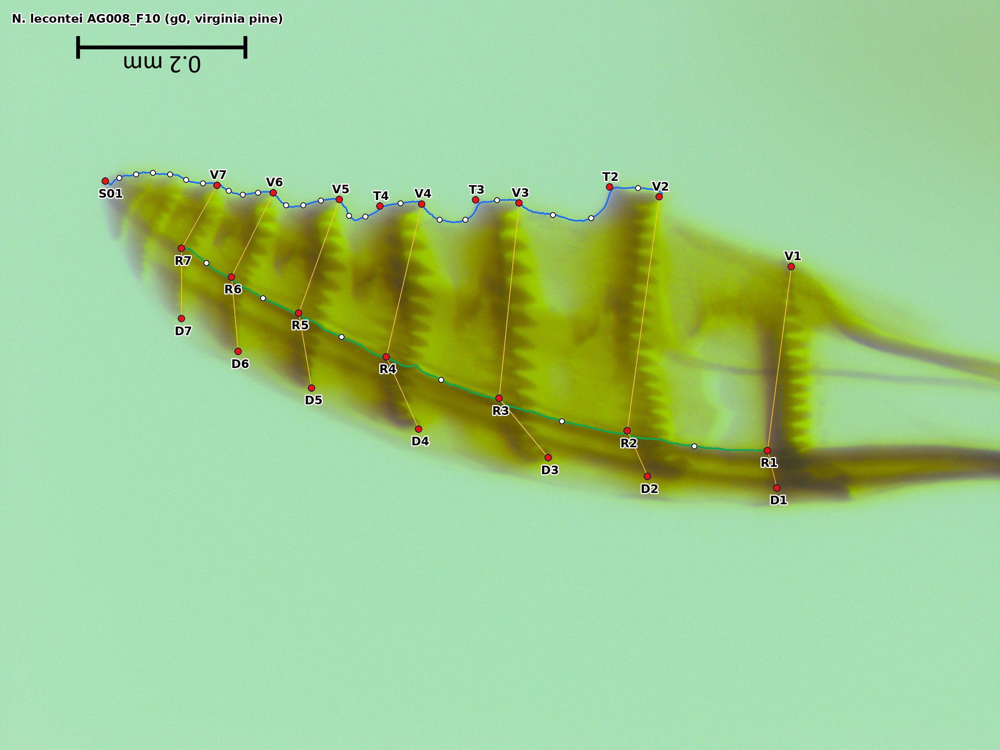
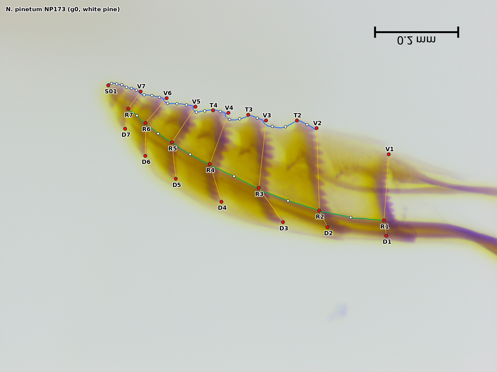
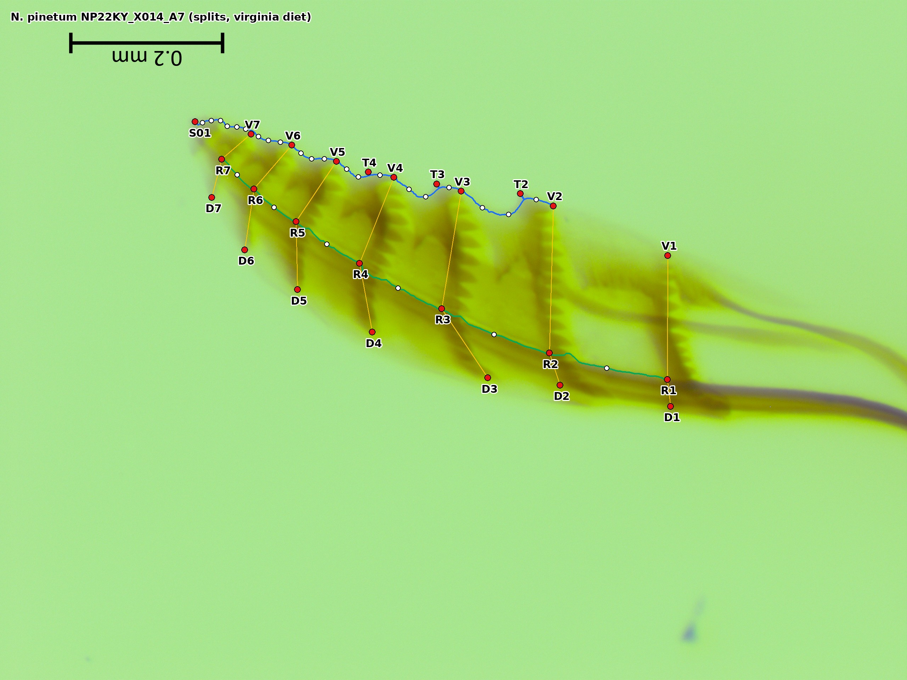

# A landmark + semilandmark protocol for the *Neodiprion* ovipositor saw (first valvula), built for CNN digitization

*Protocol v1.2, 2026-09-27. v1.2 (lab decision after reviewing the label overlays) ends the rachis curve at R7 and drops the pale dorsal outline curve and its start point C01 (§3.3). v1.1 added the rachis curve, the saw's side of the olistheter, so saw and lance can be compared within females along their shared interface (§8). Replaces the "Saw Morphometrics" section of `ovipositor_morphometrics_protocol_v6.docx`. The imaging steps in that document are unchanged, apart from the calibration and orientation notes in §6. **Every image, saw and lance, is calibrated from its own burned-in scale bar** (§6, item 1). Modelled on the lance protocol in `../genai_lance_landmarking/`.*

| File | What it is |
|---|---|
| `Saw_Landmarking_Protocol.md` | this document |
| `landmark_schema.json` | machine-readable point, curve and computed-point definitions, the geomorph slider matrix, and the old → new point mapping |
| `figures/protocol_lecontei_AG008_F10.jpg`, `figures/protocol_pinetum_NP173.jpg`, `figures/protocol_pinetum_NP22KY_X014_A7.jpg` | the protocol drawn on real specimens (anchors migrated from the human points, curves traced automatically) |
| `tools/scheme.py` | single source of truth for the scheme; the figures and schema are generated from it |
| `tools/draw_protocol.py`, `tools/export_schema.py`, `tools/outline.py` | figure and schema generators; silhouette and outline tracing |
| `tools/autolabel.py` | converts all old human configurations to v1.2 labels, with QC → `autolabels/labels_v12.csv`, `autolabels/qc_v12.csv` (v1.0/v1.1 files kept) |
| `tools/export_saw_xy.py` | autolabels → `analysis/output/saw_v12_XY.csv` (ID, side, X1..Y52 in mm), the layout the saw CNN export will use |
| `tools/pairing.py` | matches each saw to the same female's lance images → `analysis/data/saw_lance_pairs.csv` |
| `analysis/saw_lance_traits.py`, `analysis/saw_lance_integration.R` | within-female saw × lance traits and analyses (§8) |
| `tools/czi_meta.py`, `tools/scalebar.py` | read the pixel size from `.czi` metadata; measure the burned-in scale bar |
| `tools/audit/` | the scripts behind every number in §1 (`old_protocol_audit.py`, `old_vs_anchor_subset.R`, `session_scale_check.py`, `load_old.py`) |
| `analysis/output/` | audit outputs (`old_protocol_audit.json`, `old_vs_anchor_subset.csv`) |

Legend for the figures: **red dot** = anchor, **purple diamond** = computed point, **white circle** = sliding semilandmark, **blue line** = traced outline, **green line** = traced rachis curve, **orange line** = the annulus band V–R–D (drawn for orientation only; it is not a curve).

---

## Summary

The old protocol clicks 32 points and treats all of them as fixed landmarks. Most of them are good: the median inter-observer error is 2.3 µm, and the ventral annulus ends, serrula tips and annulus × rachis junctions are repeatable to 1–3 µm. The problems are specific:

1. **Two points are not the same structure in the two species.** Point 14 is the 9th annulus in *N. lecontei* and the pre-apical notch in *N. pinetum*. Points 13 and 32 (annulus 8) are the last annulus in *pinetum* but the second-to-last in *lecontei*. Any pooled-species Procrustes fit (e.g. `combined_all` in `saw_landmarking/scripts/combined_landmark_analysis_v1.R`) superimposes non-corresponding points.
2. **A few points are poorly defined:** 25 and 26 ("most proximal part of the annulus above the rachis", 19 and 12 µm median disagreement), 24 (12 µm), 1 (8 µm), and the two notches 4 and 7, whose error runs 86–95% along the outline. That is the signature of a point that should slide.
3. **Most of the toothed edge is unsampled.** There are no points on the serrula lobes apart from three tips, and none on the ventral margin distal to annulus 8.
4. **Pixel scale.** Every image was calibrated with a single global value, 0.0004628 mm/px (2160.7 px/mm). The images' own scale bars show three session-specific calibrations: 2140 px/mm (2026 sessions), 2142.5 (most 2024 sessions) and 2160 (February 2024, red bars). So most old mm values are ~0.9% small, and the February 2024 ones are correct. Shape is unaffected, but absolute size carries a session bias. v1.1 calibrates every image from its own bar.

The new protocol has **25 anchors and 27 sliding semilandmarks, 52 points in all**, plus a separate **annulus record** (count and spacing of every annulus). All 25 anchors have an old-protocol equivalent, so **326 of the 408 existing digitized images convert to v1.0 training labels automatically** (§5). On the old data, the 25 anchors alone keep the biological signal: species, host, colony and pinetum-diet effects are equal or stronger by effect size Z (§1.4).

---

## 1. Evidence from the existing data

All numbers come from the 408 human-digitized configurations in `g0/marked_images/*/txt` and `splits/marked_images/*/txt` (404 × 32 points, 4 × 33). 361 of them were matched to their rows in the PRIME tables by identical coordinates (`tools/audit/load_old.py`).

### 1.1 Inter-observer error (14 specimens digitized on the same image by two people)

Fourteen splits specimens were digitized by both BH and GK on the same image, which gives a direct measure of inter-observer error. A fifteenth pair (`NL22NE_X012_A27`) has old points 18–21 shifted by ~290 px: one digitizer skipped an annulus. It is excluded from the per-point numbers but counted as evidence (§1.5).

| Old point | Median disagreement (µm) | Share of error along the outline | New role |
|---|---|---|---|
| 25 annulus 1 "most proximal part above rachis" | **18.8** | 0.26 | dropped |
| 24 annulus 2 × dorsal rachis margin | **12.3** | 0.77 | D2 (redefined, watch item) |
| 26 annulus 2 "most proximal part above rachis" | **12.3** | 0.40 | dropped |
| 1 annulus 1 ventral | 7.8 | 0.28 | V1 (redefined as band end) |
| 15 apex | 5.9 | 0.58 | S01 |
| 27 annulus 3 dorsal | 5.5 | 0.49 | D3 |
| 23 annulus 1 × dorsal rachis margin | 4.5 | 0.92 | D1 |
| 7 notch after annulus 3 | 4.1 | **0.86** | → semilandmarks |
| 4 notch after annulus 2 | 3.5 | **0.95** | → semilandmarks |
| typical: 2, 5, 8, 10–13 (ventral ends), 3, 6, 9 (tooth tips), 16–22 (rachis), 28–32 | 1.0–3.2 | 0.4–0.8 | anchors |

The notches are the classic case of an extremal point on a gentle curve: the observers agree on where the margin is but not on where along it the "highest point" falls. Sliding semilandmarks are designed for exactly this (Bookstein 1997; Gunz & Mitteroecker 2013).

### 1.2 Point 14 (and 13, 32) are not homologous across species

The old text defines point 14 as "proximal tip of the 9th annulus" for *lecontei* and "the tip of the notch just below the saw tip" for *pinetum*. Counting from the base, annulus 8 (points 13, 32) is *pinetum*'s last annulus but *lecontei*'s second-to-last. A pooled GPA therefore superimposes different structures in the tip region.

This does not create the species difference, though. PC1 of the pooled old data takes 74% of shape variance and is a clean species split (standardized separation d = 5.4). With only the 25 homologous anchors, PC1 still takes 71% and d = 5.3. The species difference is real. The non-homologous points add to its tip component but don't cause it.

### 1.3 Definitions that depend on the frame or on counting

"Highest point of the notch" (4, 7) depends on how the slide is rotated. "Most proximal part of each annulus above or coincident with the rachis" (25–32) is ambiguous at annuli 1–2, where the band meets the rachis, and those are exactly the worst points. There are 4 files with 33 points, and one annulus miscount among 15 repeat pairs.

### 1.4 The fixed anchors keep the signal (`tools/audit/old_vs_anchor_subset.R`)

Procrustes ANOVA (RRPP, 999 permutations; the term's R² after log centroid size, and after colony for the splits):

| Test | n | Old 32 points: R², Z | 25 v1.0 anchors: R², Z |
|---|---|---|---|
| Species | 361 | 0.123, 5.3 | 0.110, **6.2** |
| Host, g0 *lecontei* | 135 | 0.238, 10.9 | 0.227, **11.1** |
| Diet (A virginia / B white), splits *lecontei* | 62 | 0.021, 2.1 (p 0.025) | 0.018, 1.5 (p 0.064) |
| Diet, splits *pinetum* | 104 | 0.023, 2.8 | 0.024, **2.9** |
| Colony (family), splits *pinetum* | 104 | 0.289, 8.6 | 0.300, **9.1** |
| Digitizer, splits (after species) | 166 | 0.025, 8.4 | 0.021, 7.2 |

Dropping the 7 unreliable or non-homologous points costs almost nothing. The one weaker result is *lecontei* diet (p 0.025 → 0.064), which may have used the tip points. The full v1.0 configuration restores tip coverage through the curves, so re-test this on v1.0 labels.

Caveats:
- In g0, host is confounded with collection site, because each host was sampled at one or a few sites.
- The digitizer effect is also confounded with batch. BH, GK and EH digitized different colonies and sessions, and the same-image pairs show that observers agree closely. So this is more likely a batch/imaging-session effect than observer bias, but it has to be carried as a nuisance term either way.

### 1.5 Other issues found

- **Calibration.** `.czi` metadata gives 2141.4 px/mm for every session, but that is just the scaling profile selected in ZEN. The burned-in bars, measured between tick centres, give 2140.0 px/mm (black 0.1 mm bars; 20ii26, 23ii26, 27ii26), 2142.5 (black 0.2 mm bars; the other 2024 sessions) and **2160.0 (red 0.2 mm bars; 20ii24, 23ii24)**. Every image in a session agrees to within 1 px of bar length. Digitizers entered 2160.7 for all of them (`analysis/data/calibration.csv`, `tools/calibration_survey.py`). Apparent saw length in pixels is stable across every imaging session within a species (*pinetum* ~1450 px, *lecontei* ~1800–1890 px; `session_scale_check.py`). Magnification did not change, even though the 2026 sessions record `TotalMagnification` 5 instead of 50 and burn in a 0.1 mm bar.
- **Background colour varies by session** (green, pink, grey, white white-balance). The CNN needs colour augmentation or a colour-normalized input.
- **Specimen naming.** One specimen appears as `NE_X002_A15`, `NEX002_A15` and `NL22NE_X002_A15`, and `NP22KY_X012_B5_L` (BH) and `NE_X012_B5_L` (GK) look like the same image. 47 txt files are not in the PRIME tables, and 5 PRIME rows differ slightly from their txt files. `tools/audit/load_old.py` has a normalizer (`specimen_key`) and a coordinate matcher (`match_by_coords`).
- **Both saws of one individual:** only `RB017_G0_F3` (L and R). The L/R suffix records which saw was mounted, so the two saws are mirror images. That is fine, because the protocol mirrors `_R` images in software (§6). Saw side still has a small shape effect after mirroring (§8.2).

---

## 2. Design principles (as for the lance)

1. **Three point roles, each analysed correctly:** anchors (fixed), sliding semilandmarks (on traced curves), computed points (never clicked).
2. **Definitions relative to tissue, not the image:** no "highest/lowest". Serrula tips are extrema measured perpendicular to the V_k → V_k+1 line.
3. **Fixed cardinality only where homology is certain.** Annuli 1–7 counted from the base exist in every specimen of both species. The distal annuli (8, and 9 in *lecontei*) go to curves plus the annulus record.
4. **Continuity:** every anchor is an old point, so the old data migrate and old/new results can be compared on the same specimens.
5. **CNN-ready:** anchors become heatmap channels, curves come from a segmentation/contour head, and the computed point is post-processing. The closest anchor pairs (V4–T4, R1–D1, V3–T3) are a median 91–99 px apart at full resolution (5th percentile ≥ 65 px), so ≥ 16 px at a 4× downsampled input.

---

## 3. The protocol

Orientation (applied in software; see §6): **apex LEFT, serrulae (teeth) UP** (the "protocol frame", lab convention since 2026-09-27). This is how the saw sits on the lance, as in the SEM: saw above, its rachis along the lower edge against the lance. The old digitizations were made with the teeth down; they are flipped top to bottom on output (`tools/frame.py`). Point names stay anatomical (V/T = ventral, toothed). "Proximal" means toward annulus 1 and the ramus, "distal" toward the apex, "ventral" the toothed edge. Annuli are the dark, finely toothed dorsoventral bands. **Annulus 1 is the most proximal complete band.** The rachis is the dark longitudinal strip running near the dorsal side.





### 3.1 Anchors (25)

| ID | Type | Definition | Old # |
|---|---|---|---|
| S01 | II | **Apex**: distal tip of the saw, the point of maximum curvature where the ventral and dorsal outlines meet | 15 |
| V1 | II | **Annulus 1, ventral end of the band.** The ventral margin here is pale membrane, so the point is often a few µm inside the outline. Place it at the end of the dark band, not on the membrane. | 1 |
| V2–V7 | I | **Annulus k, ventral end**: where the band of annulus k meets the ventral (toothed) outline, the proximal base of serrula k | 2, 5, 8, 10, 11, 12 |
| T2–T4 | II | **Serrula k tip**: the most protruding point of the tooth lobe distal to V_k, measured perpendicular to the line V_k → V_k+1, not "lowest in the image" | 3, 6, 9 |
| R1–R7 | I | **Annulus k × rachis**: where the distal (toothed) edge of annulus k crosses the ventral margin of the rachis | 16–22 |
| D1–D2 | I | **Annulus k × dorsal rachis margin.** A pale cuticle strip lies above the rachis, so these are inside the saw, not on its outline. | 23, 24 |
| D3–D7 | II | **Annulus k, dorsal end of the dark band**, above the rachis. It lies below the dorsal outline; do not place it on the outline. | 27–31 |

### 3.2 Computed points (none in v1.2)

v1.1 had one, C01: the dorsal outline on the extension of annulus 1, the start of the dorsal outline curve. It was dropped with that curve (§3.3).

### 3.3 Curves (27 sliding semilandmarks)

| Curve | Chain (numbers = semilandmarks between the neighbouring anchors) | Replaces old |
|---|---|---|
| ventral | V2 –1– T2 –2– V3 –1– T3 –2– V4 –1– T4 –2– V5 –3– V6 –3– V7 –6– S01 (21) | notches 4, 7; annulus 8/9 ventral (13, 14) |
| rachis | R1 –1– R2 –1– R3 –1– R4 –1– R5 –1– R6 –1– R7 (6) | new (v1.1); ends at R7 since v1.2 |

The ventral curve samples the profile of every serrula lobe and notch, which is the cutting edge. The **rachis curve** follows the ventral margin of the rachis, an internal edge: dark above, light below. It is traced as a minimum-cost path along that edge (`tools/outline.py: trace_edge`), not on the silhouette. The rachis is the part of the saw that runs along the lance in the olistheter, so its length and curvature are the saw's half of the interface (§8). The ventral curve is not resampled per annulus distally, because annulus count differs between species.

**Why the rachis stops at R7 and there is no dorsal outline curve (v1.2).**
- **The rachis past R7.** Distal to annulus 7 the rachis fades into the tip. The three semilandmarks v1.1 placed between R7 and the apex were inconsistent from specimen to specimen in the label overlays.
- **The dorsal outline.** The pale cuticle above the band tops is faint and slightly out of focus, so the "edge" is a gradual fade. Four automatic tracings were tried on the same 8 specimens (figures in `review/dorsal_options/`):
  - a global threshold (v1.1);
  - a threshold set from each image's background noise;
  - the same, after flattening uneven illumination;
  - tracing the dorsal margin of the rachis instead.

  Each either cut in to the dark band tops, leaked onto the halo, frame or scale bar, or wandered where the rachis narrows distally. Where the line falls is set by the threshold, not the anatomy, and no human tracings exist to check it against.
- **What carries dorsal shape now.** The band ends D1–D7 (placed to ~2 µm by digitizers) carry the dorsal shape. The height of the pale dorsal strip could come back as an optional measurement if a hand-tracing test (two people × ~20 images) shows people agree on it.

### 3.4 Annulus record (not part of the Procrustes configuration)

For every complete annulus 1..n (n is normally 8 in *pinetum* and 9 in *lecontei*; hybrids and backcrosses may vary), record (a) where it crosses the rachis curve, as an arc-length distance from the apex in mm (the axis shared with the lance's sutures, §8), and (b) its ventral end as an arc-length fraction of the ventral outline V1 → S01. This gives **annulus count** and **inter-annulus spacings** as separate phenotypes, like the lance's suture detector. It also carries the information the old points 13 and 14 were trying to capture, without forcing non-corresponding points into one configuration. Species-specific analyses can add annulus 8 (and 9) as extra anchors from this record.

### 3.5 Old → new mapping

Kept (25): 1→V1, 2→V2, 5→V3, 8→V4, 10→V5, 11→V6, 12→V7, 3→T2, 6→T3, 9→T4, 15→S01, 16–22→R1–R7, 23→D1, 24→D2, 27–31→D3–D7.
Dropped (7): 4, 7 (notches → semilandmarks); 13, 14, 32 (species-dependent annulus identity → curves + annulus record); 25, 26 (worst inter-observer error). The full list with reasons is in `landmark_schema.json → old_dropped`.

---

## 4. Analysis in geomorph

The output is one row per image with X1..Y52 in mm, in `point_order` of the schema: 25 anchors, then the ventral and rachis semilandmarks.

```r
library(geomorph); library(jsonlite)
sch <- fromJSON("landmark_schema.json")
A   <- arrayspecs(xy[, -(1:k_meta)], 52, 2)
gpa <- gpagen(A, curves = as.matrix(sch$geomorph_curves), ProcD = FALSE)   # bending-energy sliding
fit <- procD.lm(coords ~ log(Csize) + Colony + Treatment, data = geomorph.data.frame(gpa, meta), iter = 999)
```

- For g0 (host), include site/population when estimating a host effect; host and site are confounded.
- For the splits (genetics vs. plasticity), `Colony` is the genetic (family) term and `Treatment` the diet (host) term; `Colony:Treatment` is G×E. Add imaging session as a nuisance term.
- Pooled-species analyses can use the full 52 points, because every point now corresponds across species.

---

## 5. Automatic labels from the old data (`tools/autolabel.py`)

The anchors are copied from the human points through the mapping in §3.5, and the ventral curve (on an automatic silhouette) and the rachis curve (internal edge) are traced. The silhouette is the colour distance from the session's background, thresholded at 0.6 × Otsu, which puts the human ventral anchors a median 4 px (≈ 2 µm) from the traced edge. **326 of 408 labels pass QC** (same for v1.0 and v1.1: no rachis trace failed). The 82 failing images, by first failure:
- 49: apex > 25 px from the silhouette (blurred tips);
- 29: a ventral anchor off the traced edge (faint teeth);
- 4: detours only (flap or tooth merged into the outline).

Failed labels are not used for training. They are the first queue for human review.

## 6. Imaging and digitizing changes

1. **Calibration: every image from its own scale bar** (lab decision, 2026-09-27; `tools/scalebar.py`, `tools/calibration_survey.py` → `analysis/data/calibration.csv`).
   - The bar is found as a thin black or red horizontal line in the lower third of the image. It is measured between its end-tick centres, or over its full length if it has no ticks.
   - Its printed value is the round length (0.02 mm … 2 mm) whose px/mm is nearest the system's nominal scale (saw 2141, lance 927). Round lengths differ by ≥ 2×, so this is unambiguous.
   - A bar that is truncated by the frame edge, or more than 2% from nominal (sessions differ by ≤ 1%), is not used.
   - Result: **all 419 saw images and 464 of 514 lance images are calibrated from their own bar.** The 51 that are not are listed in `analysis/data/calibration_problems.csv`: 48 KD lance images with no bar, 1 KD and 1 CW lance with a broken or truncated bar, and the one saw .jpg. They should be re-exported with a bar. Until then, analyses use the session median and mark it in `cal_source`.
   - For digitized saws whose raw file is missing, the bar in the marked TIFF is used (`tools/calib.py`).
   - The lance production pipeline (`genai_lance_landmarking/production/landmark_images.py`) now also takes its calibration from each image's bar (cal_source `scale_bar`). It falls back to the NIS tag or image width only when there is no usable bar, and flags that.
2. **No manual flipping.** Images are saved exactly as acquired. Software puts every image in the protocol frame (apex left, teeth up): it mirrors left-right when needed, then flips top to bottom. Both transforms are recorded (`production/image_table.csv`: `mirrored`, `vflipped`), so points map back to the raw image exactly.
3. **Keep annulus 1 and the apex fully in the frame, and focus on the distal third.** The apex was the most common QC failure and is the least sharp region.
4. **Naming:** use the PRIME ID exactly (`NL22NE_X002_A15_R.tif`), never `NE_`/`NEX` short forms, and use the same ID for the saw and the lance of one female. This is required for joining saw and lance data (§8).
5. **Saw side:** the filename's L/R records whether the left or right saw was imaged (the two are identical). It gives the same-side lance half (§8.2), so keep it in every file name.

## 7. CNN plan (mirrors lance v1.4 production)

- **Input:** in the protocol frame (apex left, teeth up), colour-normalized (grey-world or per-image background division), random hue/brightness augmentation because backgrounds vary by session; crop to the saw bounding box.
- **Heads:** 25 anchor heatmaps (DSNT); a silhouette segmentation head; a rachis-edge head (or the same min-cost trace between the predicted R anchors). The semilandmarks come from the contour or edge between predicted anchors. A 1-D detector along the predicted ventral outline for the annulus record (count + positions).
- **Built (2026-09-27): `production/`** (see its README). Images are prepared (protocol frame: apex left, teeth up; colour-normalized; 419 images). `manifest_saw_v12.csv` has 311 labelled images; `folds_saw_v12.json` has 5 folds by colony (169 colonies), balanced within cohort × species. `train_saw_v12_folds.slurm` trains the 5 models on MCC with the same network code and settings as lance v1.4. A local 1-epoch smoke test passed. Still to build: the landmarking and mm export step.
- **Label review first:** `review/label_review.csv` lists 82 QC failures with overlays, 9 undigitized images, 4 files with 33 points, and the annulus-shift pair. Many apex flags look like false alarms: the point is on the tip, but the automatic outline stops short in the faint tip.
- **QC flags:** as for the lance (`label_gap`, ensemble spread), plus an annulus-count vs species check.

## 8. Comparing saw and lance within a female

### 8.1 The paired data

The lances of the g0 females were imaged whole (not slide-mounted) with the lance protocol (Right = the right half, Left = the left half, Bottom). The long half is normally the right. They are in `g0/raw_corresponding_lances/` (KD and CW), and `tools/pairing.py` matches them to the saws → `analysis/data/saw_lance_pairs.csv`.

- **139 g0 females have a saw image and lance images; 129 have all three lance views** (after the 2026-09-27 ID fixes, `analysis/data/renames_2026-09-27.csv`). 134 of them have PRIME metadata: 85 *N. lecontei* on 9 hosts (loblolly 17, jack 16, longleaf 14, virginia 13, red 11, pitch 6, shortleaf 4, dwarf mountain 3, spruce 1) and 49 *N. pinetum* (white pine).
- Saw side is balanced: 73 L, 65 R, 1 both.
- **The splits lances are being imaged** (all available g0 and splits lances will be). The splits are what separates genetics from diet, so they extend every analysis below to colony (family) and diet. Put them in `splits/raw_corresponding_lances/` and re-run `tools/pairing.py`.
- **20 lance-only IDs.** Some look like naming mismatches with saw files: AG0II (= AG011?), NP195 (= NP195_F?), NL064 (= NL064_F1?), AG009_F3 (saw file AG009), NL011_F3 (saw file NL011_F5). Fixing them could add up to ~7 pairs. The folder also holds 11 LBX/PBX backcross lance sets, which belong with the lance project.
- The lances are 3840×2160, the same camera system as the backcross lances, so **the trained lance v1.4 CNN applies unchanged**.

### 8.2 What physically corresponds (SEM `A033_standard_lecontei.tif`, `NP192_standard_pinetum.tif`)

- **The olistheter is the shared interface.** The saw's rachis side lies against the lance and slides along it. In the SEM the saw sits against the lance edge that the lance protocol calls **"dorsal"** (the window side, lance curve `X.dorsal`, X18 → X01). The dark, sclerotized, sutured edge the lance protocol calls "ventral" is on the far side. That fits Tait's description of the lance's anatomically dorsal, toothed edge. So the lance photographs are anatomically upside-down relative to the saw photographs. None of the analyses below superimpose the two, but every sign convention does account for it. (Confirmed by the lab, 2026-09-27.)
- **Common apex.** The saw and lance tips end together (within a few tens of µm in the SEM). So "distance from the apex along the interface" is one axis both structures can be measured on.
- **No one-to-one segment correspondence.** The lance has more, more closely spaced sutures than the saw has annuli (on the existing labels: lance sutures 1–7 span 0.35–0.92 mm from the apex, about 0.095 mm apart; saw annuli 1–7 span 0.13–0.86 mm, about 0.12 mm apart). So saw annulus k is not paired with lance suture k. Segmentation is compared through spacing and register on the shared axis.
- **Sides** (lab, 2026-09-27). An ovipositor has two identical saws, and the filename's L/R records whether the left or the right saw was imaged. Each saw runs on the lance half on its own side: the right saw on the right half (lance Right view), the left saw on the left half (lance Left view). So the **same-side lance half is given by the saw's own L/R**.
  - The lance's long half is normally the right and rarely the left. `saw_lance_traits.py` measures it per female as `lance_long_side`, comparing the two half lengths X02 → ventral margin → X01. On the 298 backcross lances, the right half is > 2% longer in 163 (55%) and the left in 18 (6%), and 117 are within 2% (median right/left 1.022). This agrees with "rarely the left".
  - After mirroring, saw side has a small shape effect in the old data (R² 0.006, Z 5.8; none on size; `tools/audit/saw_side_test.R`). The saws are identical, so this is more likely a mounting or imaging difference between left- and right-facing slides than biology. Side stays a nuisance covariate.

### 8.3 The analyses (`analysis/saw_lance_traits.py` → `analysis/saw_lance_integration.R`)

The two structures are imaged separately, so their coordinates are never superimposed into one configuration. The olistheter lets the saw slide back and forth on the lance, so there is no fixed relative position to recover anyway. Instead:

| # | Question | Measure | Test |
|---|---|---|---|
| 1 | **Size coupling** | log CS of the saw vs each lance view; relative saw size = log CS(saw) − mean log CS(lance halves) | correlation within species × host; relative size ~ host (*lecontei*) |
| 2 | **Interface fit** | saw rachis arc length R1 → R7 and sagitta/chord, vs the lance interface edge (X18 → X.dorsal → X01) arc length and sagitta; mismatch = log length ratio and sagitta difference | within-group correlation; does host shift the mismatch? A matched olistheter predicts tight coupling |
| 3 | **Segmentation** | annulus and suture positions as mm from the apex; mean spacing; spacing ratio; (later) counts from the annulus record and the lance suture detector | within-group correlation of spacing; is the spacing ratio constant? |
| 4 | **Shape integration** | two-block PLS of saw shape vs each lance view after removing species × host means (static integration); **same-side vs opposite-side lance half** (each female gives one saw); PLS on *lecontei* host means (among-population integration) | `two.b.pls`, `compare.pls`. If local mechanical coupling matters, same-side > opposite-side; if integration runs through shared size or development, they are equal |
| 5 | **Shared host response** | one model on saw PC1–10 + lance PC1–10 | `procD.lm(Y ~ log CS + Host (+ imager))` |

`saw_lance_traits.py` produces one row per female: saw logCS, rachis length and sagitta, annulus 1–7 positions and blade heights; per lance view logCS, interface length and sagitta, suture 1–7 positions; Bottom logCS. The scripts were checked end to end with the saw v1.1 labels and backcross lances randomly relabelled as g0 females (scratch only). Everything came out null, as it should. The expected strong lance Right ~ Left size correlation was r ≈ −0.07 under random pairing, so it doubles as a check that the pairing is correct.

**To run on the real data:**
1. Landmark the g0 lances with the v1.4 production pipeline and export (`landmark_images.py`, then `export_geomorph.py --out-dir .../geomorph_g0`).
2. Build the saw table: `tools/export_saw_xy.py` for the human-derived labels, or the saw CNN export later.
3. Run `python analysis/saw_lance_traits.py --lance-dir <geomorph_g0>`.
4. Run `Rscript analysis/saw_lance_integration.R <saw XY> <geomorph_g0>`.

### 8.4 Calibration matters more here than anywhere else

Relative size and interface mismatch are ratios between two microscopes, so any calibration error enters directly.
- Saw: each image's own bar (2140, 2142.5 or 2160 px/mm by session; §1.5, §6 item 1).
- Lance, KD images: the 1 mm bar measures 928–929 px, matching the v1.4 pipeline's 927 px/mm.
- **Lance, CW images: the bar measures 917–918 px, ~1.1% fewer.** The old v1.4 calibration (fixed 927 px/mm, bar only checked within 1.5%) would have made CW lances ~1.1% too large.

Either CW's zoom differs slightly or the bar is drawn differently. Every lance is now calibrated from its own bar, so this no longer biases mm values. `imager` stays a covariate in the R script.

### 8.5 Saw-protocol changes made for this (v1.1, revised in v1.2)

1. **Rachis curve** (R1 … R7, 6 semilandmarks; v1.1 continued to the apex, v1.2 stops at R7): the saw's half of the interface, measurable as length, curvature and positions from the apex (along the rachis to R7, then straight R7 → apex).
2. **Annulus record along the rachis:** annulus positions as mm from the apex, the same axis the lance sutures are expressed on.
3. **Per-image calibration** from each image's own scale bar (saw and lance), and **one ID per female** across saw and lance files (§6).

No change to the lance protocol is needed. Everything above uses points the lance v1.4 CNN already predicts.

## 9. Open items and validation before adoption

1. **Repeatability of the new definitions** (V1, D1, D2, D3–D7 as band ends; T tips measured perpendicular to V_k → V_k+1; the rachis trace): a small repeat-digitizing set, e.g. 20 specimens × 2 digitizers × 2 sessions.
2. **Dorsal outline (dropped in v1.2):** only if the pale strip's height is wanted biologically, first run a hand-tracing agreement test (two people × ~20 images).
3. **Annulus count variation:** survey the counts across all images (is it always 8/9 by species?), and whether annulus 1 is ever ambiguous.
4. **Retest lecontei diet** on v1.2 labels (§1.4), and re-run the old analyses with per-image calibration.
5. **Saw–lance:** re-export the 48 bar-less KD lance images (and the 2 with broken bars) with a scale bar; resolve the lance-only ID mismatches (§8.1). The splits lances are being imaged; `tools/pairing.py` picks up `<cohort>/raw_corresponding_lances/` for every cohort.
6. **Lance CNN on these images:** the g0 lances come from new imagers (KD, CW), so review the `label_gap` / spread flags before trusting them. The v1.4 models were trained on the backcross images.
